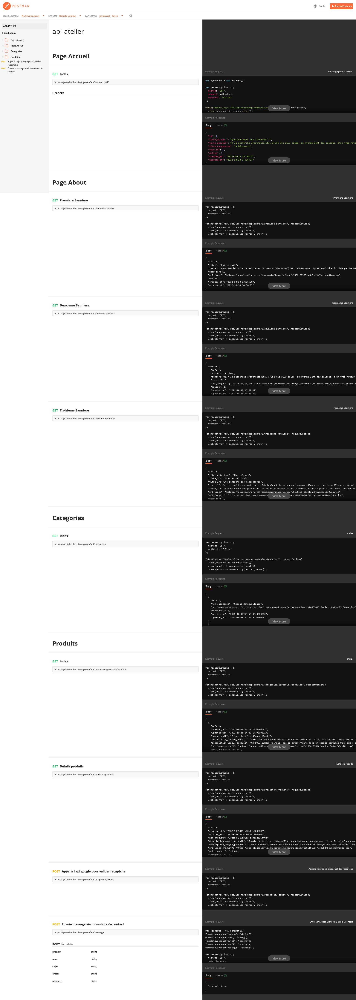

<h1>
    Projet Atelier Ginette
</h1>
<h2>Partie back-end</h2>

Le back-end se décompose en 2 parties d'un côté d'un dashboard d'administration pour gérer le contenu du site et d'un autre côté des route pour faire fonctionner l'API pour le front

<h3>Documentation de l'API</h3>

